Here are some examples of high ranking resultant models:
# 1. 503
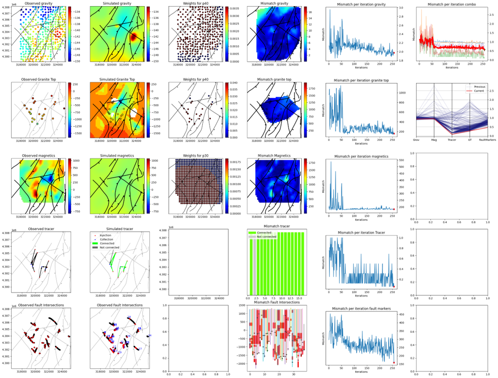
# 2. 727
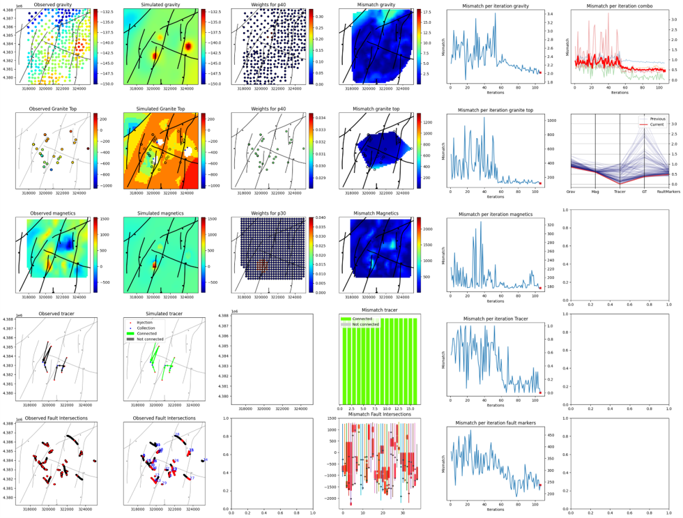
# 3. 1772
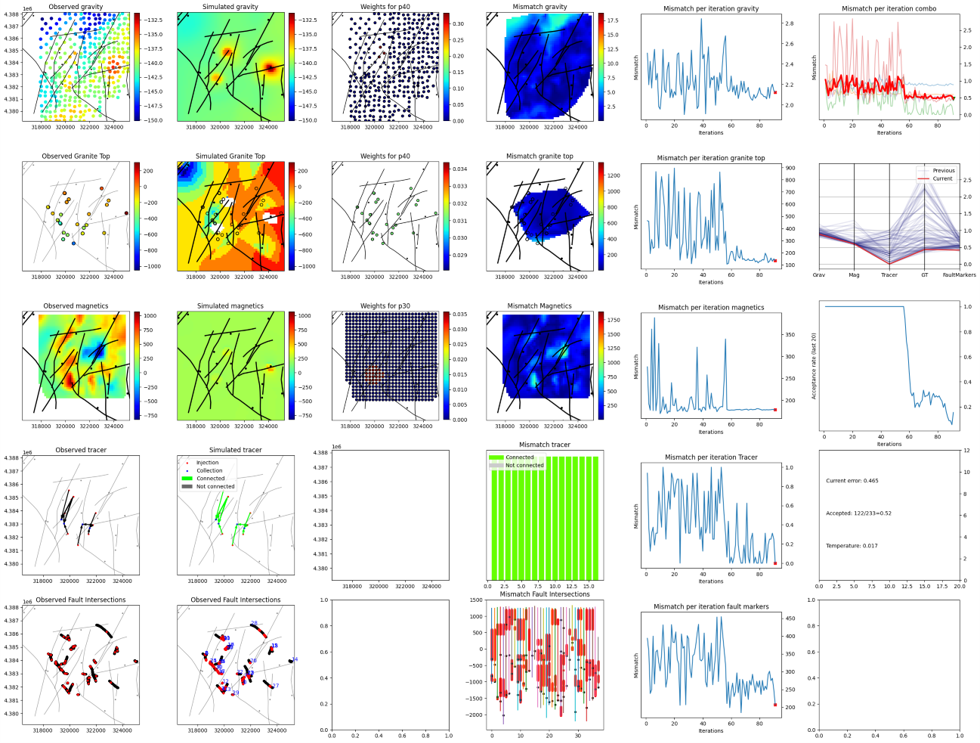
# 4. 1809
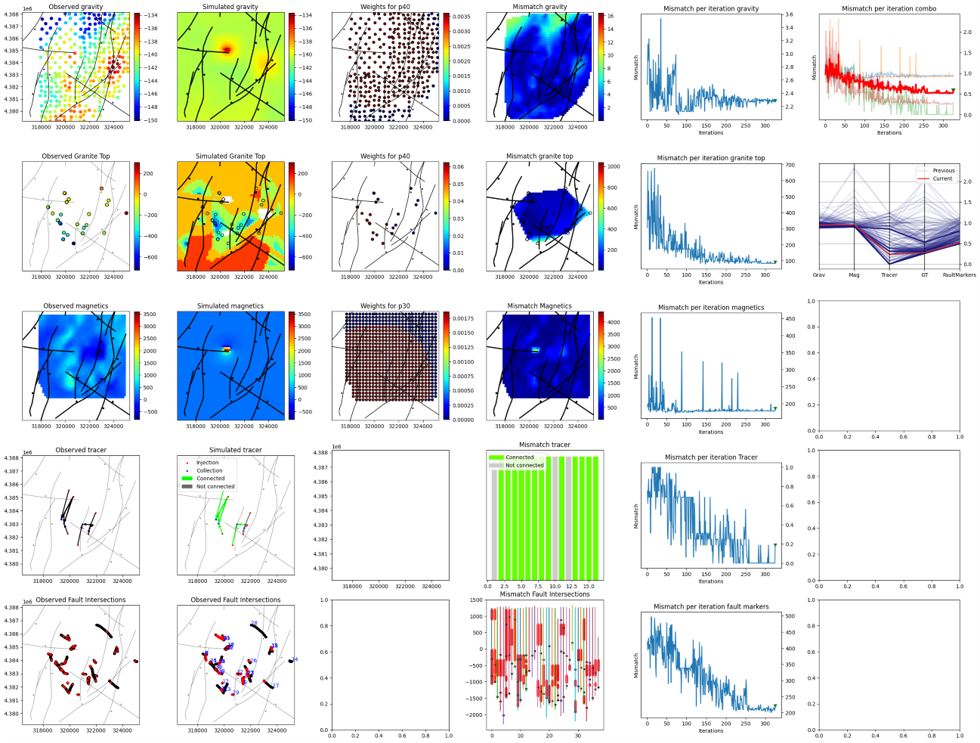
# 5. 2151

# 6. 2445

# 7. 2587
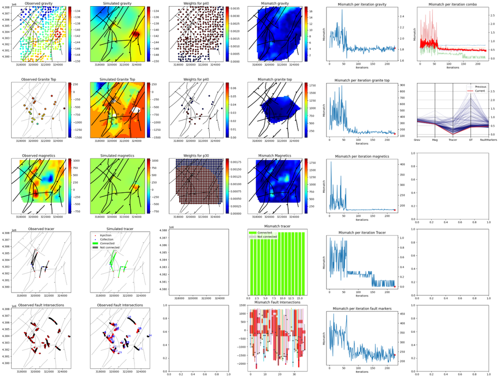
# 8. 4135

# 9. 4375
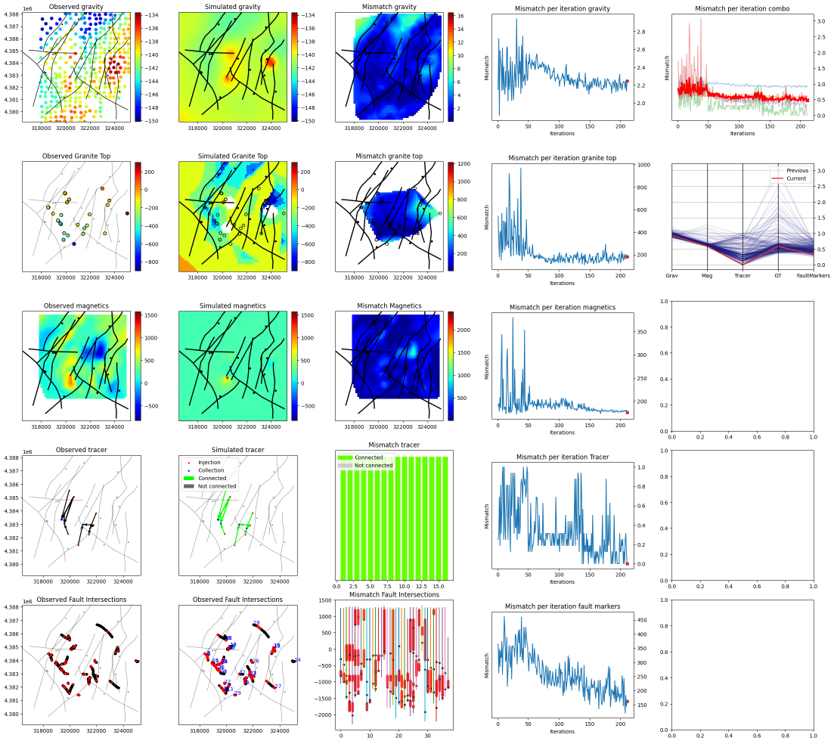
# 10. 4891
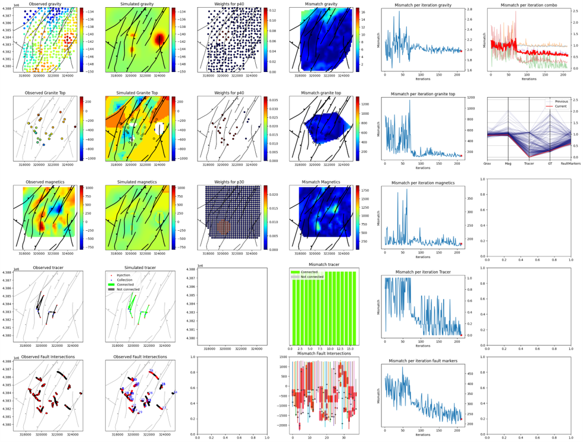
# 11. 5133
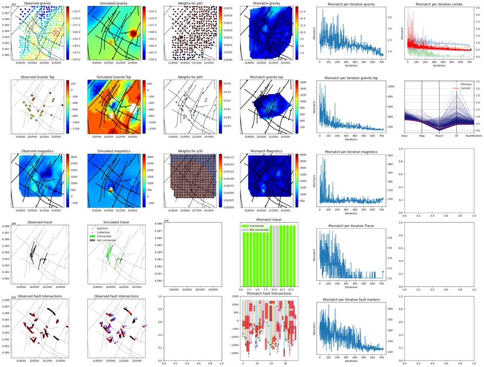
# 12. 6039
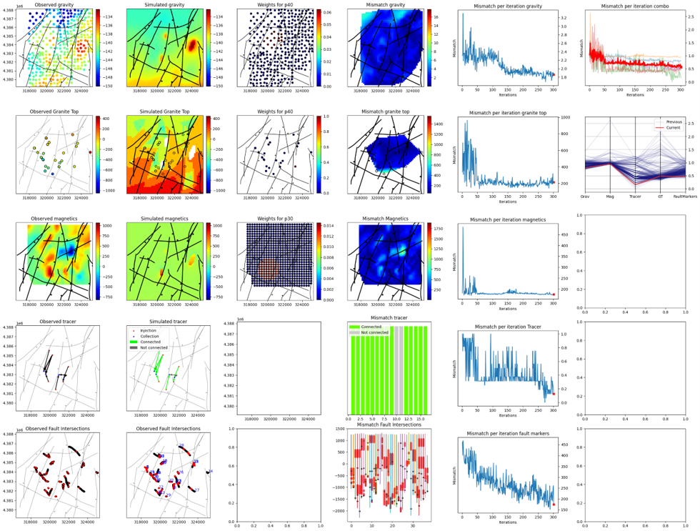
# 13. 1553
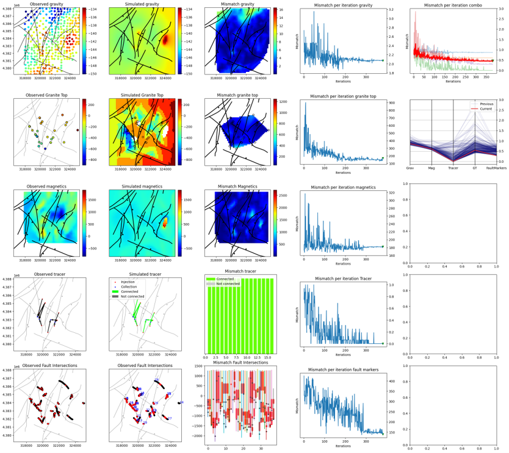
# 14. 1772

# 15. 2675
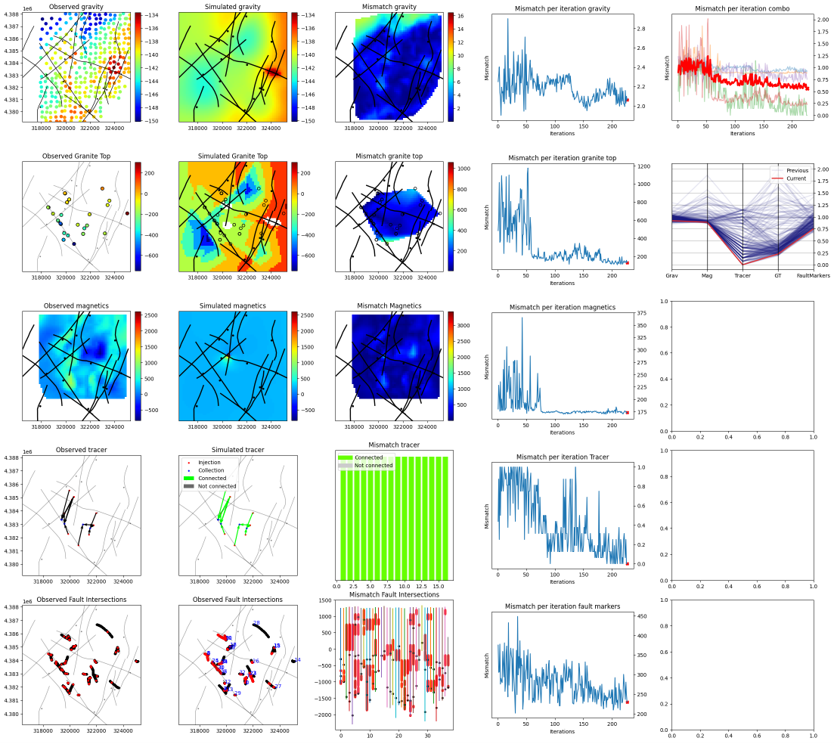
